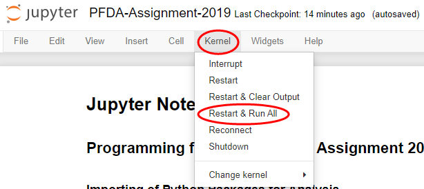

# PFDA-Project-2019
Git repository for Project 2019 for module Programming for Data Analysis: Simulation of children born in Ireland.

## Running the Jupyter Notebook
1. Click this [link](https://github.com/Dowline1/PFDA-Project-2019) for my Github repository.
2. Click the download button to save a copy of the repository on your machine.
3. Make sure you have Python installed including Jupyter, if you require installation please follow instructions in this [link](https://www.anaconda.com/distribution/) to download Python via Anaconda.
4. Use your command line such as CMDER to navigate to the folder housing the Git repository, download for CMDER found via this [link](https://cmder.net/).
5. Once in the folder type the command "Jupyter Notebook" and click enter.
6. This will open a Jupyter Notebook in your default web browser, click on the file "PFDA-Project-2019.ipynb".
7. Once in the Jupyter Notebook itself click on Kernel then Restart And Run All as per **image below**, this will run the code and generate all graphs.

All data and commentary relating to project can be found within the Jupyter Notebook, please refer here for my submission.

## References
Association for Improvements in the Maternity Services - Ireland, 2014. INDUCTION OF LABOUR – IS IT RIGHT FOR YOU?. [Online] 
Available at: http://aimsireland.ie/induction-of-labour-is-it-right-for-you/
[Accessed 11 Dec 2019].

Central Statistics Office Ireland, Unknown. Vital Statistics Annual Report 2017 - Births 2017, Dublin: Central Statistics Office Ireland.

Chao, F., Gerland, P., Cook, A. R. & Alkema, L., 2019. Systematic assessment of the sex ratio at birth for all countries and estimation of national imbalances and regional reference levels. PNAS, 116(19), pp. 9303 - 9311.

Charnigo, R., Chesnut, L. W., LoBianco, T. & Kirby, R. S., 2010. Thinking outside the curve, part I: modeling birthweight distribution. BMC, 28 Jul.10(37).

Janssen, P. A. et al., 2007. Standards for the measurement of birth weight, length and head circumference at term in neonates of European, Chinese and South Asian ancestry. Open Medicine, 10 Jul, 1(2), pp. 74-88.

Jukic, A. M. et al., 2013. Length of human pregnancy and contributors to its natural variation. Human Reproduction, 6 Aug, 28(10), pp. 2848 - 2855.

Nassar, N., Schiff, M. & Roberts, C. L., 2013. Trends in the Distribution of Gestational Age and Contribution of Planned Births in New South Wales, Australia. PLoS One, `20 Feb, 8(2), p. 56238.

Office for National Statistics UK, 2019. Birth characteristics in England and Wales: 2017. [Online] 
Available at: https://www.ons.gov.uk/peoplepopulationandcommunity/birthsdeathsandmarriages/livebirths/bulletins/birthcharacteristicsinenglandandwales/2017
[Accessed 09 Dec 2019].

Office for National Statistics UK, 2019. Standard deviation of the mean age of mother at 1st, 2nd, 3rd, 4th and 5th birth, 1969 to 2017, England and Wales. [Online] 
Available at: https://www.ons.gov.uk/peoplepopulationandcommunity/birthsdeathsandmarriages/livebirths/adhocs/009572standarddeviationofthemeanageofmotherat1st2nd3rd4thand5thbirth1969to2017englandandwales
[Accessed 09 Dec 2019].

Ritchie, H. & Roser, M., 2019. Gender Ratio. [Online] 
Available at: https://ourworldindata.org/gender-ratio
[Accessed 01 Onward December 2019].

Walsh, A.-M., 2008. Big is beautiful as experts dispel 'sumo baby' myth. [Online] 
Available at: https://www.independent.ie/irish-news/big-is-beautiful-as-experts-dispel-sumo-baby-myth-26454311.html
[Accessed 01 Onward December 2019].

Walsh, A.-M., 2019. Irish birth rate still high but first-time mothers are among oldest in EU. [Online] 
Available at: https://www.independent.ie/irish-news/health/irish-birth-rate-still-high-but-firsttime-mothers-are-among-oldest-in-eu-37908011.html
[Accessed 09 Dec 2019].

